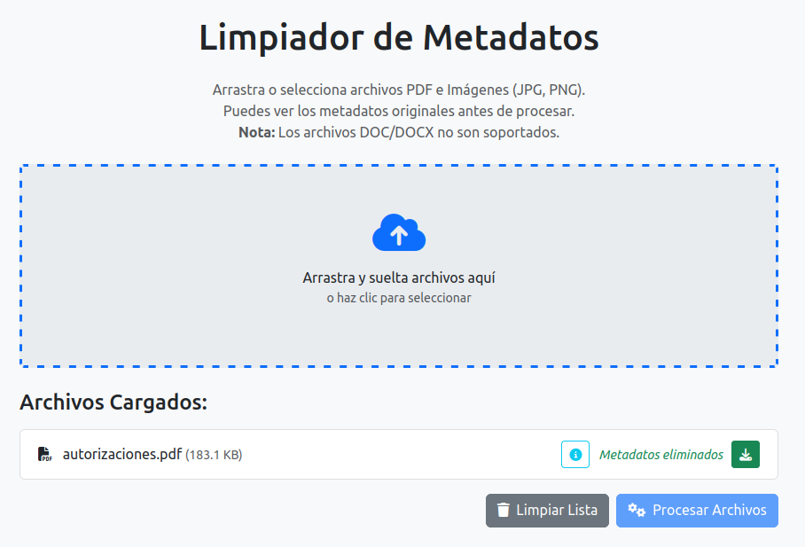

# 🧹 Metadata Cleaner

<!-- Badges -->
<p align="left">
  <a href="https://opensource.org/licenses/MIT">
    
  </a>
   
   
</p>

---

Una aplicación web simple y **del lado del cliente** para eliminar metadatos potencialmente sensibles de tus archivos PDF e imágenes (JPEG, PNG) directamente en tu navegador. 🚫 ¡No se sube ningún archivo a ningún servidor, garantizando tu privacidad! 🛡️



## 📝 Descripción

Los metadatos incrustados en archivos como fotos (datos EXIF que incluyen configuración de la cámara, ubicación GPS 📍) o PDFs (autor, título, software de creación 💻) pueden revelar más información de la deseada. Esta herramienta proporciona una forma sencilla de **ver y eliminar** estos metadatos antes de compartir los archivos.

Todo el proceso ocurre localmente en tu navegador web usando JavaScript. ✨

## ✨ Características Clave

*   🖱️ **Interfaz Drag & Drop:** Añade archivos fácilmente arrastrándolos a la zona designada.
*   👆 **Selección de Archivos:** Haz clic para abrir el selector de archivos estándar.
*   ✅ **Formatos Soportados:**
    *   📄 **PDF:** Visualización y eliminación de metadatos.
    *   🖼️ **Imágenes:** Visualización de metadatos (EXIF para JPEG) y eliminación (para JPEG, PNG, GIF).
*   🔍 **Vista Previa de Metadatos:** ¡Mira los metadatos detectados *antes* de procesar el archivo! (Usando `exif-js` para JPEGs y `pdf-lib` para PDFs).
*   💻 **Procesamiento Local (Client-Side):** No se requiere subir archivos al servidor. Todo se ejecuta en tu navegador.
*   💾 **Descarga de Archivos Limpios:** Obtén versiones de tus archivos sin los metadatos.
*   📱💻 **Diseño Adaptable (Responsive):** Construido con Bootstrap 5 para usabilidad en diferentes tamaños de pantalla.

## 🤔 ¿Cómo Funciona?

*   **Imágenes:** La herramienta carga la imagen en un Canvas HTML5. Al volver a dibujar la imagen y exportarla desde el canvas (usando `canvas.toBlob()`), la mayoría de los metadatos (como EXIF) se descartan de forma natural, ya que solo se copian los datos de los píxeles.
*   **PDFs:** Se utiliza la potente librería `pdf-lib` para cargar la estructura del PDF, apuntar y limpiar específicamente los campos de metadatos estándar (Título, Autor, Asunto, Palabras clave, Creador, Productor, Fechas), y luego guardar una nueva versión del PDF sin esa información.
*   **Limitaciones:** Procesar formatos complejos como `.doc` o `.docx` completamente en el lado del cliente no es factible actualmente con esta herramienta debido a su complejidad. Estos tipos de archivo se marcan como no soportados. ❌

## 🛠️ Tecnologías Utilizadas

*   HTML5
*   🎨 CSS3 (con Bootstrap 5 para estilos y layout)
*   ⚡ JavaScript (Vanilla JS)
*   [Bootstrap 5](https://getbootstrap.com/)
*   📄 [pdf-lib](https://pdf-lib.js.org/) - Para manipulación de PDF.
*   📷 [exif-js](https://github.com/exif-js/exif-js) - Para leer datos EXIF de JPEGs.
*   👍 [Font Awesome](https://fontawesome.com/) (Opcional, para iconos)

## ▶️ Uso

1.  **Clona el repositorio:**
    ```bash
    git clone https://github.com/soyunomas/metadata-cleaner.git
    ```
    *(Asegúrate de usar el nombre final que elegiste para el repositorio)*
2.  **Navega al directorio:**
    ```bash
    cd metadata-cleaner
    ```
3.  **Abre el archivo `index.html` (o la versión todo-en-uno si la usas) en tu navegador web.** 🌐

¡Eso es todo! No se necesita ningún proceso de construcción ni servidor. 🎉

## 📜 Licencia

Este proyecto está licenciado bajo la Licencia MIT - consulta el archivo `LICENSE` para más detalles (o simplemente indica que tiene licencia MIT si no añades un archivo separado).

## 😎 Autor

*   **soyunomas** - [https://github.com/soyunomas](https://github.com/soyunomas)

---

*Nota: Esta herramienta intenta eliminar los campos de metadatos comunes. Podría no eliminar cada pieza de datos no estándar o profundamente incrustada en todas las variaciones de archivos. Siempre verifica doblemente los archivos sensibles si se requiere certeza absoluta.*
